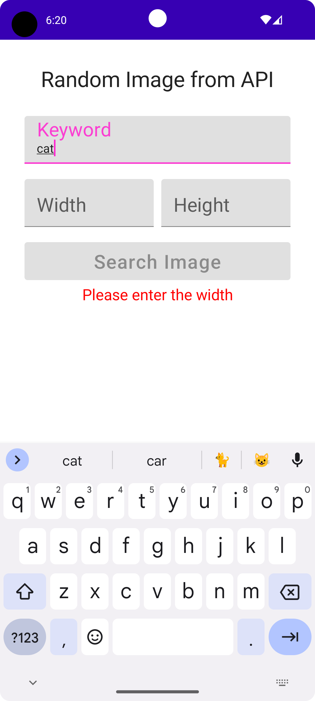
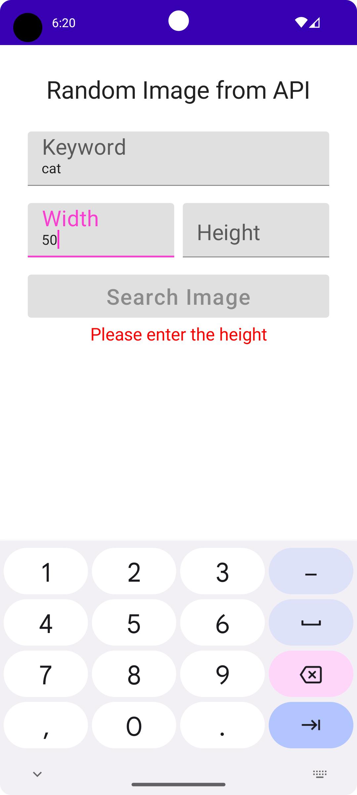
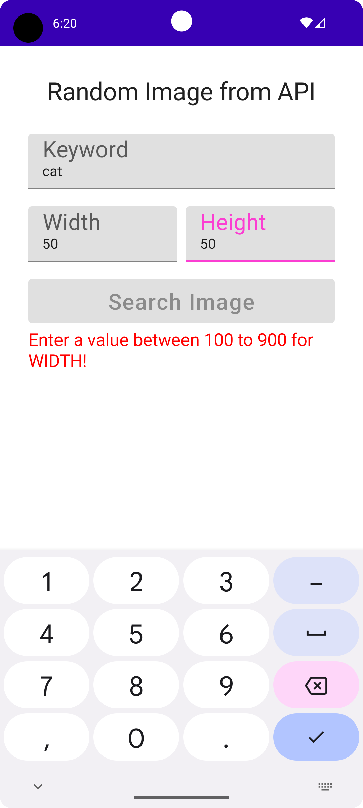
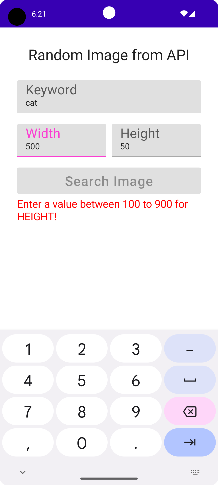
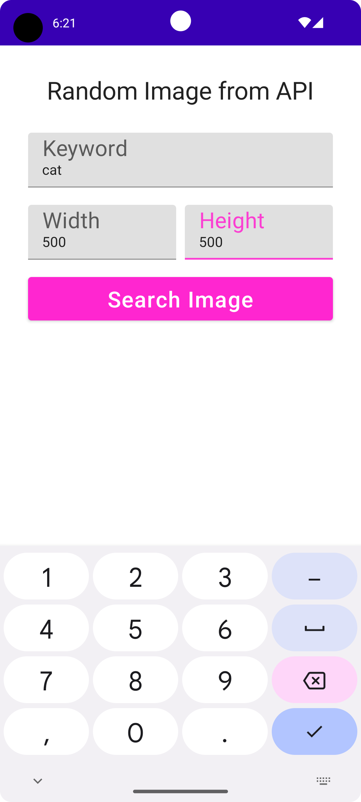
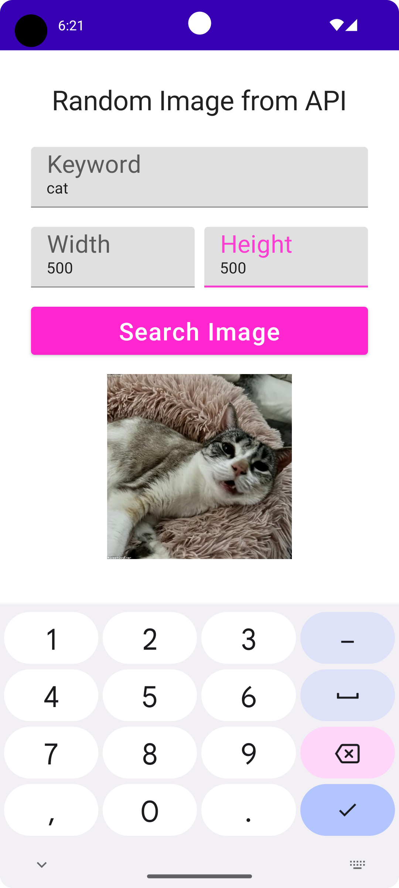

# cn333as4

## โปรแกรมสุ่มรูปภาพ (Android App: Random Image)
- สร้างAndroid App: Random Image
- ผู้ใช้สามารถเลือกขนาดของรูปได้ โดยหากผู้ใช้ป้อนขนาดที่ไม่ถูกต้อง โปรแกรมจะแสดงข้อความเตือน และให้ป้อนค่าใหม่
- ผู้ใช้สามารถเลือกประเภทของรูปจากตัวเลือกได้
- เมื่อผู้ใช้ป้อนและเลือกข้อมูลครบถ้วนและถูกต้องจะสามารถกดปุ่มแสดงรูปได้
- เมื่อกดปุ่มแสดงรูปโปรแกรมจะทําการแสดงรูปตามค่าที่กําหนดโดยผู้ใช้ในขั้นตอนข้างต้น

# สมาชิกในกลุ่ม
#### Variya Kittiwattanachok 6310610958
#### Woraphat Wannaphong 6310611055

# ขั้นตอนการใช้งาน
1. git clone https://github.com/6310610958/CN333as4.git
2. Android Studio เลือก file => new => import project => เลือกfileที่cloneไว้
3. กด Run or Shift + F10

# ตัวอย่างโปรแกรม
เมื่อทำการ Run ขึ้นมา

ทำการป้อน Keyword

ทำการป้อน Width

ทำการป้อน Height

เมื่อทำการป้อนค่าที่ไม่ถูกต้อง โปรแกรมจะแสดงข้อความเตือน และให้ป้อนค่าใหม่

เมื่อทำการป้อนค่าที่ถูกต้องทั้งหมดแล้ว ปุ่ม Search Image จะปรากฏสีขึ้นให้สามารถทำการกดได้

เมื่อทำการ Search Image รูปภาพที่เรา Input ค่าต่าง ๆ เข้าไปจะปรากฏขึ้น

# Demo สาธิตวิธีการใช้งาน
LinkVideo=> [Click_Here](https://youtu.be/pg7fsfvJBvs)
